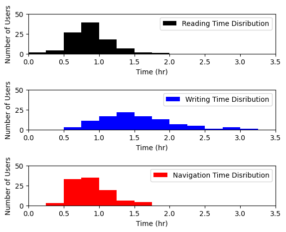

# H-MOG Data Analysis

H-MOG data set is a multimodal data set for evaluating continuous authentication performance in smartphones. [http://www.cs.wm.edu/~qyang/hmog.html](http://www.cs.wm.edu/~qyang/hmog.html). H-MOG data was collected from 100 users performing reading, writing, or map navigation tasks for 15 minutes each. Participants were asked to complete 24 sessions (8 sessions per task) in walking and sitting body motion conditions. In total, each participant contributed between 2 to 6 hours of behavior traits. While H-MOG contains 9 different categories from motion sensors to touch and scroll events, we select and synchronize the accelerometer and gyroscope motion sensors data.

In this repository, pre-processing and visualization of H-MOG dataset is presented using Tableau and Python. An interactive plot was created using Tableau and is available in the link below:

https://public.tableau.com/profile/faraz.hosseinzadeh.zorofchi#!/vizhome/HMOGDataAnalysis-DistributionofTimeperGestureandActivity/Dashboard1

 
 
 Also the following plots are generated using the hmog_visualization.py.
 
 Distribution of reading, writing and map navigation task of participants in H-MOG data:
 
 
 
 CDF of time for each task in sitting and walking conditions:
 
 
 
